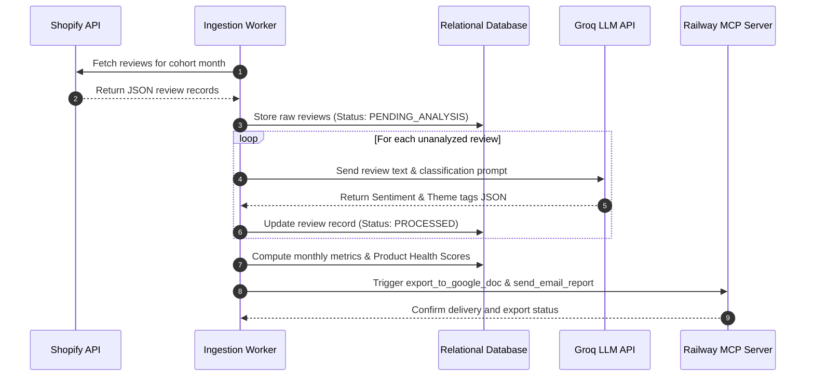
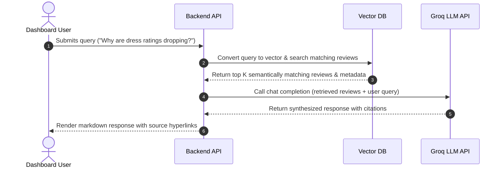

# POPFLEX Review Intelligence Platform: Architectural Specification

This document details the software architecture, data flow pipelines, database schema designs, and technology stack for the **POPFLEX Review Intelligence Platform**.

---

## 1. System Overview
The POPFLEX Review Intelligence Platform is designed to ingest raw Shopify customer reviews, process them for sentiment and key fashion themes, calculate catalog health indexes, auto-report results to external services (Gmail, Google Docs), and power an interactive natural-language QA interface for internal teams.

```
                  +-----------------------------------+
                  |      DTC Shopify Reviews API      |
                  +-----------------------------------+
                                    | (Monthly Ingestion)
                                    v
+------------------+      +-------------------+      +-------------------+
|  Next.js Admin   |      |    Backend API    |      |    Groq LLM API   |
|    Dashboard     | <--->|  (Node/Python)    | <--->|  (NLP & RAG Chat) |
+------------------+      +-------------------+      +-------------------+
                                    |                          |
                                    v                          v
+------------------+      +-------------------+      +-------------------+
|  Railway MCP     |      |  PostgreSQL DB &  |      |   Vector Search   |
| (Gmail & GDocs)  | <====|  Vector Storage   |      |  (e.g. pgvector)  |
+------------------+      +-------------------+      +-------------------+
```

---

## 2. Component Design & Interfaces

The platform comprises five primary architectural components:

### A. Data Ingestion Service (Cron-based)
* **Frequency:** Triggers on the 1st of every calendar month.
* **Function:** Ingests reviews since the last sync window from Shopify.
* **Data Cleaning:** Removes HTML tags, filters out duplicates, and sanitizes review text before storage.

### B. AI processing & Analysis Layer (Groq API)
* **Function:** Sequentially processes review records to extract metrics.
* **Sentiment Classification:** Grades reviews into Positive, Neutral, or Negative sentiment.
* **Theme Tagging:** Applies multi-label classification to identify Sizing/Fit, Comfort, Durability, Fabric Quality, Design/Utility, and Shipping/Logistics.
* **Inference Engine:** Powered by Groq's high-speed Llama model API for low-latency batch processing.

### C. Analytics & Reporting Core
* **Health Scoring:** Calculates the Product Health Index (PHI) for every catalog item.
* **Lifecycle Alerts:** Monitors month-over-month sentiment shifts and flags declining products.
* **Reporting Trigger:** Executes downstream exports to Google Docs and Gmail upon completing processing.

### D. Model Context Protocol (MCP) Server (Railway)
* **Role:** Acts as an execution gateway to interact with Google Workspace APIs.
* **Hosted Platform:** Deployed on Railway.
* **Available Tool Schemas:**
  * `write_to_google_doc(document_id, title, content_markdown)`: Appends monthly dashboard health report summaries and leaderboard shifts to the collaborative log document.
  * `send_email_report(recipient_email, subject, body_html)`: Composes and dispatches the styled monthly overview email report.

### E. Retrieval-Augmented Generation (RAG) System
* **Vector Index:** Powered by `pgvector` (PostgreSQL) or a standalone vector database.
* **Embedding Model:** Generates semantic vectors for review text blocks.
* **Context Retrieval:** Uses cosine similarity search to retrieve matching reviews and metrics.
* **Synthesis:** Groq LLM aggregates retrieved context to formulate natural language answers to user queries with source citations.

---

## 3. Core Data Flow Pipelines

### Pipeline A: Monthly Ingestion, Processing & Export (Sequential)


### Pipeline B: Conversational RAG Chatbot (Interactive)


---

## 4. Database Schema Design

The relational database (PostgreSQL) maintains transactional, processed, and settings data.

```
 +----------------------------------+          +----------------------------------+
 |             products             |          |             reviews              |
 +----------------------------------+          +----------------------------------+
 | PK  product_id      VARCHAR(50)  |<---------| PK  review_id       VARCHAR(50)  |
 |     sku             VARCHAR(50)  |          | FK  product_id      VARCHAR(50)  |
 |     name            VARCHAR(255) |          |     rating          INT          |
 |     category        VARCHAR(100) |          |     body            TEXT         |
 |     created_at      TIMESTAMP    |          |     created_at      TIMESTAMP    |
 +----------------------------------+          |     verified        BOOLEAN      |
                                               |     sentiment       VARCHAR(20)  |
                                               |     sentiment_score NUMERIC(3,2) |
                                               |     sync_month      VARCHAR(7)   |
                                               +----------------------------------+
                                                                 |
                                                                 v
 +----------------------------------+          +----------------------------------+
 |        monthly_analytics         |          |          review_themes           |
 +----------------------------------+          +----------------------------------+
 | PK  analytics_id    SERIAL       |          | PK  theme_id        SERIAL       |
 | FK  product_id      VARCHAR(50)  |          | FK  review_id       VARCHAR(50)  |
 |     month           VARCHAR(7)   |          |     theme_name      VARCHAR(50)  |
 |     review_count    INT          |          +----------------------------------+
 |     avg_rating      NUMERIC(3,2) |
 |     health_score    NUMERIC(3,2) |          +----------------------------------+
 |     primary_issue   VARCHAR(100) |          |        dashboard_settings        |
 +----------------------------------+          +----------------------------------+
                                               | PK  setting_id      SERIAL       |
                                               |     target_email    VARCHAR(255) |
                                               |     doc_export_id   VARCHAR(255) |
                                               +----------------------------------+
```

---

## 5. Technology Stack & Environment

| Layer | Technology Selected | Rationale |
| :--- | :--- | :--- |
| **Frontend UI** | Next.js 14 (App Router) | Server-side rendering for quick load times; built-in API routing capabilities. |
| **Styling** | Vanilla CSS (CSS Modules) | Offers clean, modular styles with zero dependencies and absolute control over aesthetics. |
| **Backend Framework** | Node.js (Express) | Asynchronous request processing fits database ingestion and parallel LLM requests. |
| **Primary Database** | PostgreSQL | Robust JSON validation capabilities, acid compliance, and SQL metrics math. |
| **Vector Search Extension** | `pgvector` | Keeps relational product data and text embeddings inside a single Postgres instance. |
| **AI LLM Inference** | Groq API (Llama-3-8B/70B) | High token-throughput and minimal inference latency ($<3$ seconds RAG replies). |
| **Integration Gateway** | Model Context Protocol (MCP) | Clean encapsulation of Gmail and Google Docs tool execution; decoupled deployment on Railway. |

---

## 6. Security, Authentication & Configuration

1. **API Keys & Secrets:**
   * Groq API keys and Google Workspace service account certificates are stored as encrypted environment variables in the Railway environment and the app hosting environment.
2. **Access Control:**
   * Next.js admin dashboard requires authentication (e.g., Auth0 or NextAuth) to configure report email targets or manually trigger integrations.
3. **Rate Limiting & Retries:**
   * Groq API calls implement exponential backoff retry algorithms to handle potential rate-limiting (`429` status codes) during large batch ingestion runs.
