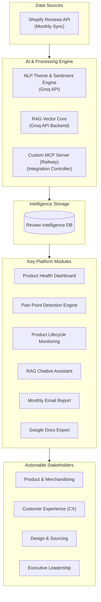

# POPFLEX Review Intelligence Platform: Problem Statement & Product Vision

## 1. Executive Summary
POPFLEX, a leading creator-led activewear brand, has fostered an incredibly active customer community that produces thousands of product reviews across its diverse catalog (leggings, dresses, activewear, fitness gear, and accessories). While these reviews are filled with high-fidelity customer feedback on sizing, fit, fabric quality, durability, and aesthetics, they remain largely unstructured, fragmented, and difficult to analyze at scale. 

The **POPFLEX Review Intelligence Platform** is a proposed AI-powered analytics solution designed to systematically ingest, analyze, and convert raw customer reviews into real-time, actionable product intelligence. By automatically structuring qualitative customer feedback, the platform will enable product managers, merchandising teams, customer experience (CX) professionals, and executive leadership to make data-driven decisions that improve product quality, optimize inventory lifecycle, and elevate customer satisfaction.

To support this product goal, the platform will implement:
1. **Monthly Data Syncing:** Automatically ingest Shopify reviews on a monthly cadence to track long-term performance shifts.
2. **Groq API Backend:** Utilize Groq API's high-speed LLM engine for lightning-fast review analysis and processing.
3. **RAG Chatbot Assistant:** Provide a Retrieval-Augmented Generation (RAG) chatbot allowing users to ask questions about dashboard data and reviews.
4. **Custom Railway-hosted MCP Server:** Integrate a Model Context Protocol (MCP) server to handle external service automation.
5. **Google Docs Export:** Automatically export dashboard analytics and reports directly to Google Docs.
6. **Monthly Email Overview:** Draft and dispatch a monthly overview report to a configurable target email address.

---

## 2. Background & Strategic Context
Unlike traditional activewear brands that rely on massive advertising budgets, POPFLEX’s competitive advantage is built on:
1. **Audience Trust & Creator Authenticity:** Founded by fitness entrepreneur Cassey Ho (Blogilates), the brand leverages a massive community of over 20M+ social followers.
2. **Community-Driven Product Development:** Products are designed to solve real customer pain points (e.g., anti-cameltoe seams, built-in shorts, adjustable sizing, functional pockets).
3. **Rapid Scalability:** The business has scaled rapidly across direct-to-consumer (DTC) ecommerce and major retail partnerships (such as Target), surpassing an estimated $100M in annual sales by 2025.

However, as the brand scales, maintaining premium product quality, consistent sizing, and reliable customer experiences becomes increasingly difficult. Product reviews represent the most honest, unfiltered representation of customer satisfaction. Today, this goldmine of data is underutilized because POPFLEX lacks a unified system to analyze, aggregate, and act upon qualitative feedback at scale.

---

## 3. The Problem
As POPFLEX expands its product lines and distribution channels, the manual reading and superficial tracking of star ratings are no longer sufficient. This manual approach introduces critical business risks:

* **Delayed Risk Detection:** Critical quality-control issues (e.g., fabric pilling, seam tearing, or zipper failures) are often detected only after returns spike or negative sentiment spreads.
* **Sizing & Fit Inconsistencies:** Fit variations across collections (e.g., leggings vs. dresses) confuse customers, causing high return rates and reducing purchase confidence.
* **Unstructured Innovation:** Valuable feature requests and design improvements suggested by customers remain buried inside thousands of reviews, missing the product roadmap.
* **Lack of Catalog Visibility:** Leadership and product teams lack a real-time, centralized health check of the product catalog, making portfolio decisions highly subjective.

---

## 4. The Opportunity
By transforming unstructured customer feedback into structured, searchable, and quantitative product intelligence, POPFLEX can shift from a reactive feedback loop to a proactive optimization cycle. Leveraging AI-powered review intelligence will enable POPFLEX to:
* **Accelerate Quality Iteration:** Detect design and fabric quality concerns monthly.
* **Enhance Fit Guidance:** Use real customer sizing reviews to optimize sizing charts and develop personalized fit recommendation engines.
* **Defend Premium Value:** Justify premium price points by continuously refining product details and fabric choices based on community expectations.
* **Optimize Inventory Lifecycle:** Identify underperforming or at-risk products early to plan redesigns or phase-outs before capital is tied up.

---

## 5. Proposed Solution: Platform Architecture
The proposed platform is built around six core pillars, serving different team members across the organization:

### A. Product Health Dashboard
A centralized hub that gives an immediate visual overview of the catalog's performance:
* **Product Health Score:** A composite index scoring products based on review ratings, sentiment trends, and return likelihood.
* **Sentiment Score:** A monthly score showing positive vs. negative review sentiment.
* **Category Performance Matrix:** Comparative analytics across product categories.
* **Target Email Configuration:** An interface option to specify the destination email address for the automated monthly overview report.

### B. AI Pain Point Detection Engine
An automated analysis system that scans review text using the **Groq API**, detects customer complaints, and classifies them into structured categories:
* **Theme Tagging:** Auto-categorizes reviews into *Sizing & Fit*, *Fabric Quality*, *Durability*, *Comfort*, *Design & Utility*, and *Shipping & Logistics*.
* **Severity & Frequency Analysis:** Evaluates severity and tracks frequency over monthly cohorts.
* **Impact Mapping:** Correlates specific complaints to drops in average star ratings.

### C. Product Lifecycle Monitoring
An automated alert system designed to monitor products through their post-launch lifecycle:
* **Deterioration Alerts:** Flags products with declining ratings or rising negative sentiment over monthly sync periods.
* **Unresolved Issue Tracing:** Identifies complaints that persist across batches or restocks.
* **Portfolio Action Recommendations:** Generates recommendations such as *Redesign Pattern*, *Inspect Sourcing Batch*, *Update Sizing Guide*, or *Discontinue Product*.

### D. RAG Chatbot Assistant
A conversational, Retrieval-Augmented Generation (RAG) assistant powered by the **Groq API** backend:
* **Dashboard Data Queries:** Users can ask natural language questions (e.g., *"Why did the Leggings category score drop this month?"* or *"Summarize comfort issues for sizing XL"*).
* **Information Retrieval:** Fetches relevant reviews and dashboard statistics to provide evidence-backed, synthetically aggregated answers.

### E. Automated Monthly Email Overview
A cron-scheduled reporting module that runs following the monthly data sync:
* **Automated Drafting:** Compiles the latest monthly dashboard stats, catalog health scores, and critical product alerts into a clean overview report.
* **Gmail Delivery:** Sends the report to the dashboard-specified email address using the custom **Railway-hosted MCP Server**.

### F. Google Docs Export Integration
An export utility that automates data persistence in collaborative spaces:
* **Auto-Exporting:** Writes and formats monthly dashboard metrics, trend summaries, and AI recommendations to a target Google Doc.
* **Google Docs API Bridge:** Uses the custom **Railway-hosted MCP Server** to manage document generation and appending logic.

---

## 6. Key Dashboard Visualizations

| Module | Visualization Component | Key Metrics Displayed | Target Audience |
| :--- | :--- | :--- | :--- |
| **Executive Overview** | KPI Cards & Trend Sparklines | Overall NPS, Catalog Health Index, Monthly Review Volume, Configured Target Email | Executive Leadership |
| **Product Leaderboards** | Top-Performing & At-Risk Lists | Highest/Lowest Rated Products, Monthly Sentiment Gainers/Losers | Product Managers, Sourcing |
| **Theme Analysis** | Pain Point Heatmap & Theme Breakdown | Frequency and rating impact of Sizing, Quality, and Comfort complaints | Design Teams, QA Managers |
| **RAG Chatbot Panel** | Conversational Chat Interface | Prompt input, Groq-synthesis text, citation links to matching reviews | All Teams |
| **Integration Center** | Export & Delivery Status | Sync schedule log, Google Docs link, manual "Send Report" and "Export to Docs" triggers | Merchandisers, CX Admins |

---

## 7. Success Metrics

### Product Performance Metrics
* **80% Reduction** in manual review analysis and report preparation effort.
* **90% Target Accuracy** in automated theme classification and sentiment tagging using Groq API.
* **<3 Seconds** RAG chatbot response latency powered by Groq API's high-speed inference.

### Business & Operational Metrics
* **100% Delivery Success** for monthly email reports to the dashboard-designated address.
* **100% Export Integrity** for dashboard data written to Google Docs via the MCP server.
* **Reduced Return Rates:** Lower product returns caused by sizing mismatches or quality defects.
* **Lower Customer Support Ticket Volume:** Proactive fixes on sizes and materials lead to fewer customer complaints.

### User & Adoption Metrics
* **Weekly Active Users (WAU):** Adoption rates among product, design, and CX teams.
* **AI Query Success Rate:** Accuracy and utility of answers provided by the RAG chatbot.
* **Actionable Insight Rate:** Percentage of AI-flagged issues that result in concrete product or description updates.
